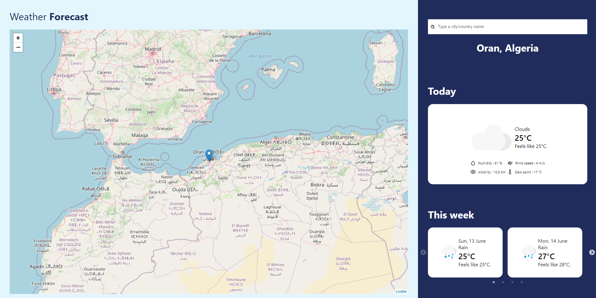

# Weather Forecast App 
A Weather App Done with ReactJS through the OpenWeatherMap API to get the Weather and Cities, and the React Leaflet library for the map. 

## How To run 
Simply execute npm start, make sure you have a .enb file with the variable REACT_APP_WEATHER_API_KEY that has the value of your own OpenWeatherMap API Key. 
## Functionnalities
1. Display Weather, city name and position from user location (if accepted).
2. Display Weather and city name (if available in the API) of the position clicked in the map. 
3. Searching by city/country and getting its weather/position in the map. 
4. See the weather today and over the next 7 days. 

## To Do List 
1. Change weather units by user preferences.